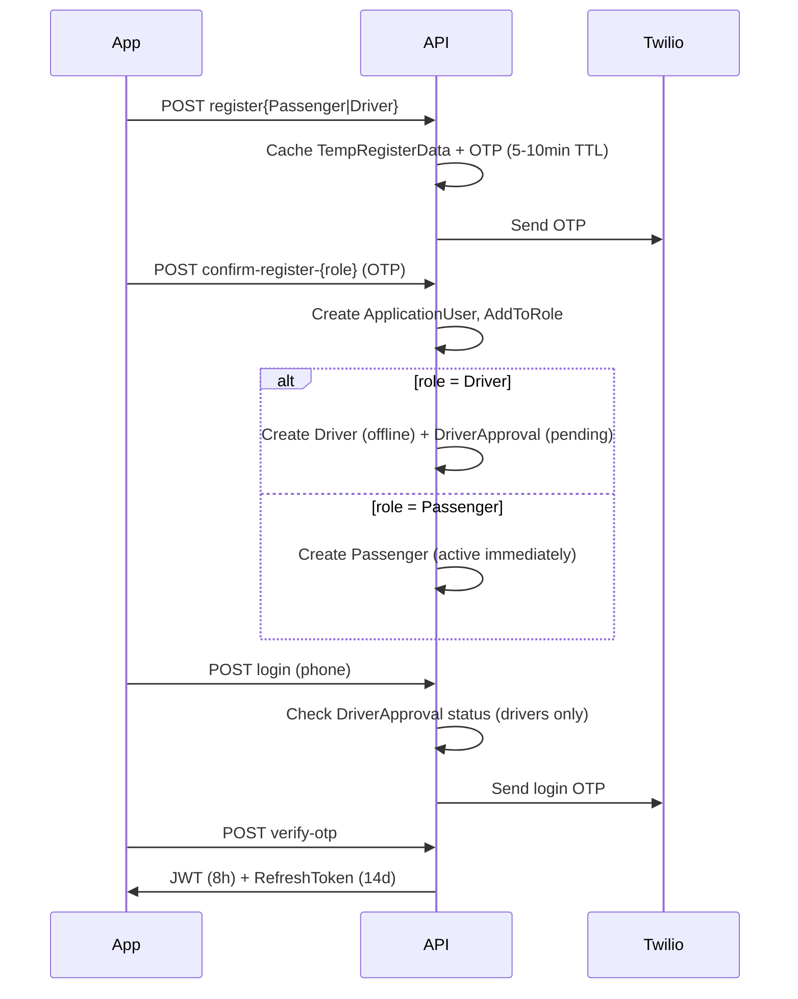
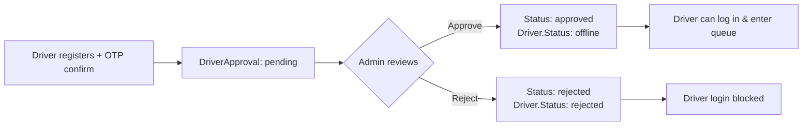
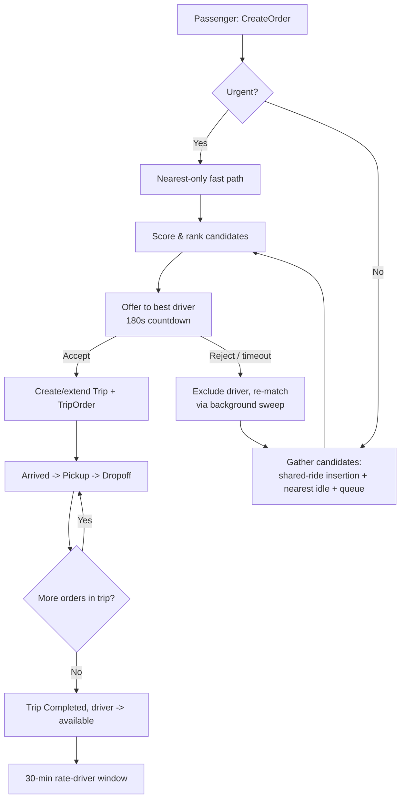
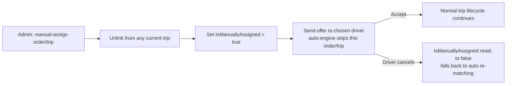
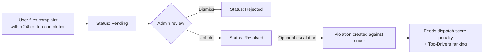

# TaxiApp.Backend — System Analysis & API Documentation

Generated from a full read-through of the solution. Scope: 3 projects, 19 controllers (84 actions), 20 repositories, 9 helper/background services, 20 domain models, ~53 DTOs.

**Update (2026-06-20)**: `MessagesController` implemented — in-trip chat between driver and passenger is now live (send, conversation thread, conversation list), closing the gap noted in the original §7. Details in §4.9 and §8.

**Update (2026-06-20, later same day)**: four backend bugs/gaps found and fixed while building the Flutter Passenger MVP — Orders missing `OrderId`/`Status` in responses, no notification history endpoint, no passenger self-service profile endpoint, and uploaded images being unservable (no static-file middleware). Details in §9.

---

## 1. System Overview

**Stack**: ASP.NET Core 9 Web API, EF Core (SQL Server), ASP.NET Identity (passwordless/OTP), JWT bearer auth, SignalR (real-time), Twilio (SMS/OTP), Google Maps Distance Matrix + Directions API (ETA/routing), Mapster (entity↔DTO mapping), local-disk file storage for images.

**Architecture**: Clean/onion architecture, 3 projects:
- `TaxiApp.Backend` (Api) — Controllers, `Program.cs`, `FileService`, static `Images/`.
- `TaxiApp.Backend.Core` — Models, DTOs, Interfaces, Settings, `JwtService`. No EF/infra dependency.
- `TaxiApp.Backend.Infrastructure` — `ApplicationDbContext`, EF Migrations, Repositories (implement Core interfaces), Helpers (SignalR hub, background services, Google/Twilio integrations).

**Domain**: A dispatcher-mediated taxi/ride-hailing platform. Distinctive features vs. a typical Uber-clone:
- **Office-mediated dispatch**: an `Admin` ("office") role can run the whole system in `Auto` or `Manual` mode (`SystemSettings.SystemMode`), and drivers physically/virtually "enter a queue" (`OfficeQueueEntry`, FIFO) to become eligible for trip offers — this isn't a pure GPS-nearest-driver model.
- **Ride pooling**: `Order` (a passenger's request) and `Trip` (a driver's run) are many-to-many via `TripOrder`, so one driver can carry multiple passengers' orders concurrently (`DriverStatus.Shared`), with per-passenger sub-status (`TripOrderStatus`) tracked independently of the trip's overall status.
- **Multi-factor dispatch scoring**: candidate drivers are ranked by a weighted formula combining ETA, shared-ride route-insertion cost, violation count, fairness (today's trip load), rating, and queue wait time — not simply "closest driver."
- **No fare/payment system found** — see §7 Missing Information.

**Domain model (entities)**:

| Entity | Represents |
|---|---|
| `ApplicationUser` | Identity account shared by drivers, passengers, office staff |
| `Driver` / `Passenger` | 1:1 profile extension of `ApplicationUser` (table-per-type split) |
| `Vehicle` | A driver's car (one "current" vehicle enforced via filtered unique index) |
| `Order` | A passenger's ride request |
| `Trip` | A driver's executed run (may carry several `Order`s) |
| `TripOrder` | Join entity (composite PK) — order's status *within* a specific trip |
| `DriverApproval` | Office onboarding approval workflow for a driver |
| `OfficeQueueEntry` | A driver's FIFO position in the dispatch queue |
| `DriverLocation` | GPS breadcrumb history (throttled, auto-purged after 1 day) |
| `Rating` | 1–5 star rating, one per (trip, rater, target) |
| `Notification` | In-app/push notification record |
| `Message` | Chat message, scoped to an `Order`/`Trip` (exposed via `MessagesController`, see §4.9) |
| `Complaint` / `Violation` | Two-tier disciplinary system (complaint → optional escalation to violation) |
| `UserBlock` | Time-windowed account suspension |
| `FavoriteLocation` | Passenger's saved places |
| `RefreshToken` | Hashed, rotating JWT refresh tokens |
| `SystemSettings` | Singleton `Auto`/`Manual` dispatch-mode toggle |
| `OrderReview` | Office manual review of flagged orders (e.g., large vehicle requests) |

**Core relationship chain**:
```
ApplicationUser ──1:1── Driver ──1:N── Vehicle
       │                  │──1:N── Trip ──N:M (TripOrder)── Order ──N:1── Passenger (User)
       │──1:1── Passenger                          │                  │
                                              Rating(Trip,Order)   Message / OrderReview
```

**Status enums driving the workflow**:
- `OrderStatus`: Pending → SearchingDriver → (PendingOfficeReview) → AssignedToTrip → Completed | Cancelled | NoDriverFound
- `TripStatus`: SearchingDriver → Assigned → DriverArrived → InProgress → Completed | Cancelled | NoDriverFound
- `TripOrderStatus` (per passenger within a trip): Assigned → DriverArrived → PickedUp → DroppedOff | Cancelled | Unassigned
- `DriverStatus`: offline → available → Shared/busy (→ offline on approval/rejection/accident)
- `ApprovalStatus` (driver onboarding): pending → approved | rejected
- `ComplaintStatus` / `ViolationStatus`, `ReviewStatus`, `QueueStatus`: standard pending/active → resolved lifecycles

---

## 2. User Roles & Permissions

Four Identity roles are seeded at startup (`Program.cs`); only three are actually used:

| Role | Used? | Who | Access |
|---|---|---|---|
| **Admin** | Yes | Office/back-office staff | Full management surface: users, drivers, passengers, vehicles, complaints/violations, manual dispatch, blocking, reporting/dashboards. Seeded with a default account (phone-based login like everyone else; its seeded password is never actually checked by any login path). |
| **Driver** | Yes | Drivers | Driver-only endpoints, gated by a **two-stage approval workflow** — cannot log in while `DriverApproval.Status` is `pending` or `rejected`. |
| **Passenger** | Yes | Riders | Passenger-only endpoints: orders, trips, ratings, favorite locations, profile. No approval gate — active immediately after OTP confirmation. |
| **SuperAdmin** | **No** | — | Seeded into the Identity role table but never assigned to any user and never referenced by any `[Authorize(Roles=...)]`. Dead/aspirational — flagged in §7. |

**Authorization patterns observed**:
- Most controllers apply a single role via class-level `[Authorize(Roles="...")]`.
- `SettingsController`, `NotificationsController`, and 3 actions in `AccountController` (logout, request/confirm change-phone) allow **any authenticated role**.
- `ComplaintsController` and `AccountController` have **no class-level auth** — every action declares its own (mixed anonymous/Admin/any-authenticated).
- `AccountController`'s registration/login/OTP/refresh endpoints are intentionally public (no `[Authorize]`).
- `UsersController.ChangeUserRole` lets an Admin reassign **any user to any free-text role string** with no allow-list — flagged in §7.
- SignalR `NotificationHub` requires `[Authorize]` to connect; inside the hub, users with the `Admin` role are auto-joined to a shared `office` group.

**Account-status gating**: most authenticated actions additionally call a shared `BaseController.CheckUserAccessAsync(userId)` which blocks the request (401/403) if the account is deleted, blocked, or inactive. `FavoriteLocationsController` duplicates this manually but **omits the block check** — an inconsistency flagged in §7.

---

## 3. Features

**Authentication & Account**
- Phone + OTP registration (separate flows for Driver vs Passenger), OTP-based login (no password path used), JWT + rotating/hashed refresh tokens with theft/reuse detection, phone-number change flow, logout (token revocation).

**Driver Onboarding**
- Driver registers → `DriverApproval` created `pending` → Admin reviews (approve/reject with notes) → driver gains login access only once approved.

**Vehicle Management**
- Add/edit vehicles (with document/photo upload), assign/unassign to driver (one "current" vehicle per driver enforced), activate/deactivate, list unassigned vehicles.

**Order & Trip Lifecycle**
- Passenger creates an order → automatic or admin-manual dispatch → driver accept/reject (180s offer window) → arrived → pickup → dropoff → completed; ride pooling (multiple orders per trip) supported; driver-initiated cancellation with reason re-triggers re-matching.

**Dispatch Engine**
- Multi-factor scored auto-matching (ETA, shared-route insertion cost, violations, fairness, rating, queue wait), urgent-order fast path, FIFO office-queue fallback, global Auto/Manual mode toggle, full manual admin override (force-assign driver to order/trip).

**Real-Time**
- SignalR: personal (`user-{id}`), office (`office`), and per-trip (`trip-{id}`) channels; live driver location broadcast, trip-status push, route/ETA recalculation push, generic notification push.

**Ratings**
- Passenger rates driver 1–5 stars within a 30-minute post-completion window, once per order.

**Complaints & Violations**
- Passengers/authenticated users file complaints against a trip (24h window after completion); Admin reviews, can escalate to a formal `Violation`, which feeds into the driver's dispatch score and "top drivers" ranking.

**User Moderation**
- Time-windowed block/unblock of any user by Admin; soft-delete/restore for drivers and passengers.

**Passenger Conveniences**
- Favorite/saved locations, trip history report (date-range), app settings (language, dark mode, notification toggle), static "contact us" WhatsApp link.

**Driver Conveniences**
- Profile/document management, trip/earnings history report, office-queue entry.

**Admin Reporting**
- Paginated/filterable/sortable Orders & Trips dashboards, top-drivers leaderboard (weighted score), driver/passenger directories, admin profile.

**Background Automation**
- Offer-timeout/retry sweep (every 5s), delayed-trip detection & alerts, refresh-token cleanup (6h), data-retention purges for location history/notifications/resolved complaints (24h).

**External Integrations**
- Google Distance Matrix/Directions (ETA, batch ETA, polylines — fails soft to "exclude candidate" rather than throwing), Twilio SMS (OTP delivery, fails soft to `false`).

---

## 4. API Endpoints (grouped by feature)

Base route convention: `api/[ControllerName]` unless noted. JWT bearer auth (`Authorization: Header`) except where marked **Anonymous**. All times/IDs as per the DTOs noted.

### 4.1 Authentication & Account — `AccountController` (no class-level auth)

| Verb & Route | Auth | Body / Params | Purpose |
|---|---|---|---|
| POST `registerPassenger` | Anonymous | `RegisterPassengerRequest` | Start passenger registration, sends OTP |
| POST `confirm-register-passenger` | Anonymous | `ConfirmOtpRequest` | Confirm OTP, creates Passenger account + role |
| POST `registerDriver` | Anonymous | `RegisterDriverRequest` | Start driver registration, sends OTP |
| POST `confirm-register-driver` | Anonymous | `ConfirmOtpRequest` | Confirm OTP, creates Driver account (status `pending` approval) |
| POST `login` | Anonymous, rate-limited 5/min/IP | `LoginRequest` (CountryCode, PhoneNumber) | Sends login OTP (blocked if driver not approved) |
| POST `verify-otp` | Anonymous, rate-limited 5/5min | `VerifyOtpRequest` | Verifies OTP, issues JWT + refresh token |
| POST `request-change-phone` | Authenticated, rate-limited 3/min | `ChangePhoneRequest` | Sends OTP to new phone number |
| POST `confirm-change-phone` | Authenticated, rate-limited | `ConfirmChangePhoneRequest` | Confirms OTP, updates phone/username |
| POST `refresh-token` | Anonymous (token is the credential) | `RefreshTokenRequest` | Rotates refresh token, issues new JWT |
| POST `logout` | Authenticated | `RefreshTokenRequest` | Revokes the supplied refresh token |

### 4.2 User & Role Management (Admin) — `UsersController`, `UserBlocksController`

| Verb & Route | Purpose |
|---|---|
| GET `api/Users/GetAll?pageNumber&pageSize` | Paginated list of all users |
| GET `api/Users/GetUserById/{userId}` | Single user detail |
| GET `api/Users/SearchUsers?search&pageNumber&pageSize` | Free-text user search |
| PATCH `api/Users/ToggleUserActive/{userId}` | Activate/deactivate account |
| PATCH `api/Users/ChangeUserRole/{userId}?roleName` | Reassign Identity role (⚠ unvalidated, see §7) |
| PATCH `api/UserBlocks/{userId}/ToggleUserBlock` | Block/unblock a user (body: `ToggleUserBlockDto`) |
| GET `api/UserBlocks/GetAllBlocks?pageNumber&pageSize` | Paginated list of blocked users |

### 4.3 Driver Onboarding (Admin) — `DriverApprovalsController` (`Roles=Admin`)

| Verb & Route | Purpose |
|---|---|
| GET `pending?pageNumber&pageSize` | List drivers awaiting approval |
| GET `{driverId}` | Driver application detail (docs, stats) |
| POST `approve/{id}` | Approve driver (driver status → offline, must go online) |
| POST `reject/{id}` | Reject driver (body: `RejectDriverDto` notes) |

### 4.4 Driver Profile & Operations — `DriversController`, `DriverTripsController` (`Roles=Driver`)

| Verb & Route | Purpose |
|---|---|
| PUT `api/Drivers/update-profile` (form) | Update profile/document photos |
| GET `api/Drivers/my-trips-report?from&to` | Driver's own trip/earnings history |
| POST `api/DriverTrips/accept-order/{orderId}` (rate-limited) | Accept a dispatched order offer |
| POST `api/DriverTrips/reject-order/{orderId}` (rate-limited) | Reject a dispatched order offer |
| POST `api/DriverTrips/accept-trip/{tripId}` | Accept a full pre-built (shared) trip |
| POST `api/DriverTrips/reject-trip/{tripId}` | Reject a full trip offer |
| POST `api/DriverTrips/arrived/{orderId}` | Signal arrival at pickup |
| POST `api/DriverTrips/start-trip/{tripId}` | Mark trip in-progress |
| POST `api/DriverTrips/pickup/{orderId}` | Mark passenger picked up |
| POST `api/DriverTrips/dropoff/{orderId}` | Mark passenger dropped off / order completed |
| POST `api/DriverTrips/cancel-trip/{tripId}` | Cancel trip (body: `CancelTripDto` reason) |
| POST `api/DriverTrips/enter-queue` | Join the FIFO dispatch queue (becomes eligible for offers) |

⚠ No endpoint to *leave* the queue / explicitly go offline was found — see §7.

### 4.5 Vehicle Management (Admin) — `VehiclesController`

| Verb & Route | Purpose |
|---|---|
| GET `GetAll?pageNumber&pageSize` | List vehicles |
| GET `{id}` | Vehicle detail |
| POST `AddVehicle` (form) | Register vehicle (with photo/doc upload) |
| PUT `{id}/Edit` (form) | Edit vehicle |
| GET `GetUnassignedAsync?pageNumber&pageSize` | List vehicles with no driver |
| POST `{vehicleId}/Unassign` | Detach vehicle from driver |
| PATCH `{vehicleId}/status` | Toggle active/inactive |
| PATCH `AssignVehicleToDriver/{vehicleId}` (body: `AssignVehicleDto`) | Assign vehicle to a driver |

### 4.6 Dispatch / Manual Assignment (Admin) — `DriverAssignmentManualController`

| Verb & Route | Purpose |
|---|---|
| POST `manual-assign-order/{orderId}` (body: `AssignDriverDto`) | Force-assign one order to a driver |
| POST `manual-assign-trip/{tripId}` (body: `AssignDriverDto`) | Force-assign a whole trip to a driver |
| POST `SetMode` (body: `UpdateModeDto`) | Switch global dispatch mode Auto/Manual |
| GET `mode` | Get current dispatch mode |

### 4.7 Orders — `OrdersController` (`Roles=Passenger`)

**Update (2026-06-20)**: see §9 — `CreateOrder`/`GetAll` used to silently drop `OrderId`/`Status` from the response; fixed, plus a new `GetOrderById` detail endpoint was added.

| Verb & Route | Purpose |
|---|---|
| POST `CreateOrder` (body: `CreateOrderDto`) | Create order; auto-triggers dispatch if enabled. Returns the full `OrderDetailDto` (including the new `OrderId`). |
| GET `GetAll?pageNumber&pageSize&fromDate&toDate` | List caller's own orders. Returns `PagedResult<OrderDto>`. |
| GET `{id}` | Single order detail — `OrderDetailDto` (pickup/dropoff, status, and once a driver is assigned: trip status, driver name/photo/last location, vehicle plate/make/model/color/seats). 404 if not found or not owned by the caller. |
| PUT `{id}` (body: `EditOrderDto`) | Edit own order (only while still pending/searching) |
| PUT `{id}/Cancel` | Cancel own order (only while still pending/searching) |

### 4.8 Passenger Profile & Trips — `PassengersController`, `PassengerTripsController`, `FavoriteLocationsController` (`Roles=Passenger`)

**Update (2026-06-20)**: added `GET api/Passengers/profile` — see §9. There was previously no self-service way for a passenger to read their own name/photo/address.

| Verb & Route | Purpose |
|---|---|
| GET `api/Passengers/profile` | Caller's own profile (`PassengerProfileDto`: id, firstName, lastName, fullName, address, phoneNumber, profileImageUrl) |
| PUT `api/Passengers/update-profile` (form) | Update passenger profile/photo |
| GET `api/Passengers/trips-report?from&to` | Passenger's trip history |
| POST `api/PassengerTrips/rate-driver` (body: `RateDriverRequest`) | Rate driver post-trip (30-min window) |
| POST `api/FavoriteLocations/AddFavoriteLocation` | Save a favorite location |
| GET `api/FavoriteLocations/GetAllFavoriteLocations` | List favorite locations |
| DELETE `api/FavoriteLocations/DeleteFavoriteLocation/{locationId}` | Delete a favorite location |

### 4.9 Chat / Messages — `MessagesController` (`[Authorize]`, any authenticated role)

Scoped per `Order` — each order's chat thread is exactly between that order's passenger and the trip's assigned driver. Authorization is enforced in the repository (not by role), by checking the caller is the order's passenger or the trip's driver.

| Verb & Route | Body / Params | Purpose |
|---|---|---|
| POST `send` | `SendMessageDto` (`OrderId`, `Body`, max 1000 chars) | Send a chat message; receiver is auto-resolved from the order/trip (no need to pass a receiver id). Fails if no driver is assigned yet, if the trip isn't in an active state (`Assigned`/`DriverArrived`/`InProgress`/`Completed`), or if the caller isn't a participant. |
| GET `conversation/{orderId}?pageNumber&pageSize` | route `orderId`, query pagination (default page 1, size 30) | Returns the message thread for one order, newest first; marks the caller's unread messages in that thread as read as a side effect. |
| GET `conversations` | — | Returns the caller's list of chat threads (one per order they've messaged in), each with the other participant's info, last message preview, and unread count — sorted by most recent activity. |

Implementation notes (for the backend, not the app): `MessageRepository` resolves the trip for an order via its most recent non-unassigned `TripOrder`, picks the "other party" as passenger↔driver, persists the `Message`, then pushes a `ReceiveMessage` SignalR event (see §4.13) to both `user-{receiverId}` and `trip-{tripId}` groups, and raises a `NotificationType.MessageReceived` notification (push + notification-center entry) via the existing `INotificationRepository`. No DB schema changes were needed — `Message` and its relationships were already fully configured in `ApplicationDbContext`.

### 4.10 Complaints & Violations — `ComplaintsController` (mixed auth)

| Verb & Route | Auth | Purpose |
|---|---|---|
| POST `/api/orders/{orderId}/complaints` (note: absolute path, not under `/api/Complaints`) | Any authenticated | File a complaint about an order/trip (24h window) |
| GET `api/Complaints/all` | Admin | List all complaints |
| PATCH `api/Complaints/update-status/{ComplaintId}` | Admin | Update complaint status (may spawn a `Violation`) |
| GET `api/Complaints/violations` | Admin | List all violations |
| GET `api/Complaints/driver/{driverId}/violations-count` | Admin | Violation count for a driver |
| PATCH `api/Complaints/violations/{id}/resolve` | Admin | Resolve a violation |

### 4.11 Notifications & Settings — `NotificationsController`, `SettingsController` (any authenticated)

**Update (2026-06-20)**: added `GET api/Notifications` — see §9. There was previously no way to fetch notification history at all, only mark-as-read.

| Verb & Route | Purpose |
|---|---|
| GET `api/Notifications?pageNumber&pageSize` | Caller's own notifications, newest first — `PagedResult<NotificationDto>` |
| PATCH `api/Notifications/mark-as-read/{id}` | Mark one notification read |
| PATCH `api/Notifications/mark-all-read` | Mark all notifications read |
| PUT/GET `api/Settings/Language` | Set/get language preference |
| PUT/GET `api/Settings/darkmode` | Set/get dark mode preference |
| PUT/GET `api/Settings/Notifications` / `ViewNotificationsStatus` | Set/get notification preference |
| GET `api/Settings/ContactWithTaxiGo` | Static WhatsApp contact info |

### 4.12 Admin Dashboard — `AdminController` (`Roles=Admin`)

| Verb & Route | Purpose |
|---|---|
| PUT `edit` (form) / GET `profile` | Admin's own profile |
| DELETE `SoftDeleteDriver/{id}` / PUT `RestoreDriver/{id}` / GET `GetAllDrivers` | Driver directory management |
| DELETE `SoftDeletePassenger/{id}` / PUT `RestorePassenger/{id}` / GET `GetAllPassengers` / GET `profile/{id}` | Passenger directory management |
| GET `orders` (filter/sort/paginate via `OrderFilterDto`) | Orders dashboard |
| GET `trips` (filter/sort/paginate via `TripFilterDto`) | Trips dashboard |
| GET `top-drivers?top&fromDate&toDate` | Top-driver leaderboard |

### 4.13 Real-Time — `NotificationHub` (SignalR, `/notificationHub`, `[Authorize]`)

| Direction | Event / Method | Purpose |
|---|---|---|
| Client→Server | `SendLocation(lat,lng)` | Driver streams GPS position |
| Client→Server | `JoinTrip(tripId)` / `LeaveTrip(tripId)` | Subscribe/unsubscribe to a trip's live channel |
| Server→Client | `ReceiveNotification` | Generic push (offers, status changes, alerts) |
| Server→Client | `UpdateTripStatus` | Trip status changed (to `trip-{id}` group) |
| Server→Client | `DriverLocationUpdated` | Live driver position (to `office` and/or `trip-{id}`) |
| Server→Client | `RouteUpdated` | Recalculated route/ETA/polyline (to driver) |
| Server→Client | `LeaveTrip` / `UpdateDriverStatus` | Force client to leave trip UI / sync driver status |
| Server→Client | `ReceiveMessage` | New chat message (`MessageDto` payload) — pushed to `user-{receiverId}` and `trip-{tripId}` groups when `POST api/Messages/send` succeeds |

JWT passed via `?access_token=` query string for this endpoint specifically (WebSocket handshake limitation).

---

## 5. Required Flutter Screens

Three distinct apps/personas are implied by the role model. (Admin could be a responsive web app instead of Flutter — flag this with the user before building.)

### 5.1 Passenger App
1. Splash / onboarding
2. Phone entry (Register or Login)
3. OTP verification (shared component — used by register, login, change-phone)
4. Pending-name/profile setup (first registration only)
5. Home / Map — set pickup & dropoff, choose vehicle size, mark urgent
6. Searching-for-driver (live status, cancel order)
7. Driver-found / trip-tracking — live map, driver location, ETA, driver+vehicle info, in-trip chat (backed by `MessagesController`, see §4.9), SOS/cancel
8. Driver-arrived screen
9. In-trip screen (route polyline, live ETA, multi-stop indicator for shared rides)
10. Trip-completed → rate driver (stars + comment, 30-min window)
11. Order/trip history (date-range report)
12. Favorite locations (list, add via map picker, delete)
13. Profile (view/edit, photo upload)
14. Settings (language, dark mode, notifications toggle)
15. Notification center
16. File a complaint (against a completed/in-progress order)
17. Change phone number (request + OTP confirm)
18. Contact us (WhatsApp deep link)
19. Logout / session-expired handling

### 5.2 Driver App
1. Phone entry (Register or Login)
2. OTP verification
3. Driver registration form (with license/vehicle document upload)
4. Pending-approval screen (poll/await office decision) and Rejected screen (with notes)
5. Home/Dashboard — online status, enter-queue action, current vehicle summary
6. Incoming trip-offer screen (driver/shared-ride offer, 180s countdown, accept/reject)
7. Active trip screen — navigate to pickup, "arrived" action, "picked up" action, multi-passenger stop list for shared trips, "dropped off" action, in-trip chat with passenger (per order, via `MessagesController`)
8. Cancel-trip screen (reason selection: DriverIssue/VehicleProblem/Accident/Emergency)
9. Trip/earnings history report
10. Profile (edit, document/photo upload)
11. Notification center
12. Settings (language, dark mode, notifications toggle)
13. Office-queue status (position/wait indicator)
14. Logout / session-expired handling

### 5.3 Admin / Office App (or web dashboard)
1. Login
2. Dashboard overview
3. Driver approvals queue (list, detail, approve/reject with notes)
4. Driver directory (search, view, soft-delete/restore, assign vehicle)
5. Passenger directory (search, view, soft-delete/restore)
6. Vehicle management (list, add/edit with photo upload, assign/unassign, activate/deactivate)
7. Orders dashboard (filter/search/sort/paginate)
8. Trips dashboard (filter/search/sort/paginate)
9. Manual dispatch screen (force-assign driver to order/trip; toggle Auto/Manual mode)
10. User blocking (list, block/unblock with optional expiry)
11. Complaints management (list, update status, escalate to violation)
12. Violations management (list, resolve, per-driver count)
13. Top-drivers leaderboard
14. Admin profile

---

## 6. Application Flow Diagrams

### 6.1 Registration & Login (passwordless OTP)



### 6.2 Driver Onboarding & Approval



### 6.3 Order → Dispatch → Trip Lifecycle (Auto mode)



### 6.4 Manual Admin Override



### 6.5 Complaint → Violation



---

## 7. Missing Information / Gaps

These were confirmed by direct inspection (not just inferred) and should be resolved or clarified before/while building the mobile app:

**Security**
- `JWT:Secret` and Twilio credentials in `appsettings.json` are placeholder values committed to source control (`Key-Must-Be-At-Least-16-Characters-Long`, `YOUR_SID`, etc.) — confirm these are overridden via environment/user-secrets in real deployments, otherwise tokens can be forged.
- `UsersController.ChangeUserRole` accepts an unvalidated free-text role name — any Admin can promote any user to `Admin` with no allow-list or extra safeguard.
- `SuperAdmin` role is seeded but entirely unused — either finish its intended purpose or remove it to avoid confusion.
- CORS policy allows any origin with credentials (`AllowAll`) — confirm this is intentional for a mobile-only client.

**Functional gaps relevant to the mobile app**
- **No fare/pricing/payment model anywhere** in the schema (grepped — no Fare/Price/Payment/Amount fields exist). If passengers are charged, that's handled entirely outside this backend (cash-only assumed?) — needs clarification before designing checkout/payment screens.
- ~~`Message` entity exists but no controller exposes it~~ — **resolved 2026-06-20**: `MessagesController` added (§4.9).
- ~~`OrdersController.CreateOrder`/`GetAll` never returned `OrderId`/`Status`~~ — **resolved 2026-06-20**: see §9.1.
- ~~No way for a passenger to fetch their own notification history~~ — **resolved 2026-06-20**: see §9.2.
- ~~No self-service "get my profile" endpoint for a passenger~~ — **resolved 2026-06-20**: see §9.3.
- ~~Uploaded images were saved to disk but never servable over HTTP (no static-file middleware registered at all)~~ — **resolved 2026-06-20**: see §9.4.
- **No endpoint for a driver to explicitly leave the queue / go offline** — only `enter-queue` exists. Confirm whether going offline is meant to happen automatically (e.g., on logout) or whether a "leave-queue" endpoint is simply missing.
- **No driver-facing endpoint to view complaints/violations against themselves** — only Admin can see these. If the driver app should show "why was I flagged," this needs new endpoints.
- **`RouteUpdated` (live ETA/polyline) is only pushed to the driver** (`user-{driverId}` group), never to the passenger/trip group — confirmed by reading `TripRoutingService`. The passenger app cannot get a live route/ETA via SignalR today; it only gets `DriverLocationUpdated` (raw lat/lng) and status-change pushes. Flagged for the Flutter trip-tracking screen (§9.5) rather than worked around here.
- Username collision risk: registration sets `UserName = FirstName` only (not phone-based) — two passengers with the same first name registering around the same time can fail registration with a generic error.
- No unique constraint on `ApplicationUser.PhoneNumber` at the DB level, despite phone being the primary login identifier.

**Data-model inconsistencies (lower priority, worth a cleanup pass)**
- `Complaint`/`Violation` reference `Driver`/`Order`/`Trip`/`ApplicationUser` by raw ID with no real FK/navigation — referential integrity isn't DB-enforced for these.
- `Driver.Status` doubles as both operational state (available/busy/offline) and approval-rejection state (`rejected`), duplicating what `DriverApproval.Status` already tracks.
- `FavoriteLocationsController` bypasses the shared `CheckUserAccessAsync` block-check that every other passenger controller uses.
- Several `DriverTripsController` actions determine success/failure by substring-matching repository return strings (e.g. `result.Contains("success")`) rather than typed results — fragile if message text ever changes.

**Decisions (confirmed with project owner, 2026-06-20)**:
1. **Payment**: cash only — no fare/payment screens or backend changes needed.
2. **In-trip chat**: in scope for v1 — implemented via `MessagesController` (§4.9, §8).
3. **Admin/office surface**: build as part of the Flutter app (not a separate web dashboard) — Admin screens from §5.3 are in scope.

---

## 8. Chat Feature — Implementation & Flutter Integration Notes

Added 2026-06-20: `IMessageRepository` / `MessageRepository` (`TaxiApp.Backend.Infrastructure`), `MessagesController` (`TaxiApp.Backend.Api`), and DTOs `SendMessageDto` / `MessageDto` / `ConversationDto` (`TaxiApp.Backend.Core`). No migration was needed — the `Message` table and its FK relationships already existed in `ApplicationDbContext`.

**Design choices** (for the Flutter team building against this):
- A "conversation" is keyed by `OrderId`, not by the other user's id. This matches the app's model where a driver in a shared trip has a separate, independent thread with each passenger's order, even though they're on the same trip.
- The receiver is never passed by the client — it's resolved server-side from the order's assigned trip (passenger↔driver), so the client only ever needs an `OrderId` and the message text.
- Chat is allowed once a driver is assigned (`TripStatus.Assigned`/`DriverArrived`/`InProgress`) and for a window after `Completed`; it's blocked before a driver is assigned and once a trip is cancelled.
- `MessageDto`/`ConversationDto` deliberately omit an "isMine" flag — the Flutter app should compute that itself by comparing `senderUserId` (or `lastMessageSenderId`) against its own logged-in user id (from the JWT), so the same DTO shape works identically for both the HTTP response and the SignalR push.
- Opening a conversation (`GET conversation/{orderId}`) marks all of the caller's unread messages in that thread as read as a side effect — mirrors the existing `MarkAllRead` notification pattern, so no separate "mark read" call is needed.

**Flutter integration checklist**:
1. Send: `POST /api/Messages/send` with `{ orderId, body }`, JWT in `Authorization` header. Returns the created `MessageDto`, or `400 { message }` (Arabic) on failure (no driver yet, trip not active, not a participant, empty body).
2. Load a thread: `GET /api/Messages/conversation/{orderId}?pageNumber=1&pageSize=30` → `PagedResult<MessageDto>`, newest first.
3. Chat list / inbox screen: `GET /api/Messages/conversations` → `List<ConversationDto>`, sorted by most recent activity, each with `unreadCount` for a badge.
4. Live updates: after connecting to `/notificationHub` (existing SignalR connection used for trip tracking) and joining `trip-{tripId}` via the existing `JoinTrip` hub method, listen for the new `ReceiveMessage` event — payload is a `MessageDto`, append it to the open thread (or bump the conversations list) without re-polling.
5. No new SignalR hub methods were added — chat reuses the existing connection, group-join, and JWT-over-querystring mechanics already in place for trip tracking/notifications.
6. **Dedupe by `messageId`**: a connected client that is both auto-joined to `user-{id}` (happens automatically on every hub connection) and has also called `JoinTrip(tripId)` for the open trip will receive the *same* `ReceiveMessage` event twice (once per group). This was observed directly in the live test below. The Flutter client should ignore a `ReceiveMessage` event if it already has that `messageId` in the thread.

**Verified** (2026-06-20, against a live local instance + real SQL Server data — not just a code review):
- `dotnet build` — 0 errors.
- App boots cleanly with the new `IMessageRepository` registration; all three routes appear in `swagger.json`.
- Unauthenticated calls to all 3 endpoints → `401`.
- Real round trip on an existing order/trip: driver sends → passenger reads (auto-marked read) → passenger replies → driver reads both → driver's conversations list shows correct other-party, last message, and `unreadCount`.
- Rejection paths confirmed: messaging an order with no driver assigned yet → blocked with an Arabic error; an unrelated third user reading or sending on someone else's order → blocked with an Arabic "unauthorized" error.
- Empty-body send → `400`.
- **Real-time push confirmed**: connected a SignalR client to `/notificationHub` as the driver, called `JoinTrip(7)`, then sent a message as the passenger via HTTP — the client received the `ReceiveMessage` event live (with the correct `MessageDto` payload) and a `ReceiveNotification` event (`type: "MessageReceived"`), confirming the full real-time path works end-to-end, not just the HTTP request/response.
- All test rows (4 messages, 3 notifications) created during this verification were deleted afterward; no lasting data changes.

---

## 9. Passenger MVP Backend Fixes (2026-06-20)

While building the Flutter Passenger MVP (Home, Create Order, Orders list, Order details, Cancel Order, Trip tracking, Notifications, Profile — see the sibling `TaxiApp.Mobile` repo), four real backend bugs/gaps were found by reading the actual controller code, not just the docs. All four directly blocked one of the requested screens, so they were fixed here rather than worked around client-side (there was no client-side workaround possible for any of them — the data simply didn't exist in the response). All changes were verified against a live local instance + real SQL Server data; no lasting data changes (test passenger/order/notification/image were deleted afterward).

### 9.1 Orders: `CreateOrder`/`GetAll` silently dropped `OrderId` and `Status`

**Bug**: `OrdersController.CreateOrder` mapped the created `Order` entity to `ResponseCreateOrderDto`, and `GetAllOrders` mapped the list to `IEnumerable<ResponseCreateOrderDto>`. That DTO mirrors the *request* shape (pickup/dropoff/priority/vehicle size) and has no `OrderId` or `Status` field at all — Mapster's `Adapt<T>()` only copies properties that exist on the target type, so they were silently dropped, not just omitted by mistake in a manual mapper. **There was no way for a client to learn the id of an order it had just created, or of any order in its own list** — making "Orders list", "Order details", "Cancel Order", and "Trip tracking" all unbuildable against the real API.

**Fix**:
- `OrderDto` (already used by the Admin orders dashboard) extended with `PickupLat`/`PickupLng`/`DropoffLat`/`DropoffLng`/`Priority`/`RequiredVehicleSize` — it already had `OrderId`/`Status`/`TripId`/`Rating`/`CreatedAt`. `AdminRepository.GetOrdersAsync`'s projection was updated to populate the new fields too, so the Admin dashboard response gets richer for free.
- New `OrderDetailDto` (`TaxiApp.Backend.Core/DTO'S/OrderDetailDto.cs`) — order fields plus, once a driver is assigned: `TripId`, `TripStatus`, `DriverId`/`DriverName`/`DriverProfilePhotoUrl`/`DriverLastLat`/`DriverLastLng`, and the driver's current vehicle's `VehiclePlateNumber`/`Make`/`Model`/`Color`/`Seats`. All trip/driver/vehicle fields are `null` until a driver is assigned.
- `IOrderRepository`/`OrderRepository` gained `GetOrdersForPassengerAsync(...)` → `PagedResult<OrderDto>` and `GetOrderDetailAsync(passengerId, orderId)` → `OrderDetailDto?`.
- `OrdersController.CreateOrder` now returns the full `OrderDetailDto` (so the client gets the new order's id immediately, no follow-up call needed). `GetAllOrders` now returns `PagedResult<OrderDto>` (it already accepted `pageNumber`/`pageSize` but previously returned a bare unwrapped list with no `TotalCount`). New `GET api/Orders/{id}` returns `OrderDetailDto` or `404`.
- Dead `ResponseCreateOrderDto.cs` deleted (no longer referenced anywhere).
- **Note for the Flutter client**: `OrderDto.TripId` (used in the *list*) is a non-nullable `int` that defaults to `0` when there's no trip yet — this is the pre-existing Admin-dashboard convention, left as-is for consistency. `OrderDetailDto.TripId` (used in *detail*) is properly `int?` and is `null` when there's no trip. Don't treat `0` and `null` as different states in the list view; do treat them as different in the detail view.

### 9.2 Notifications: no way to fetch history at all

**Bug**: `NotificationsController` only had `mark-as-read`/`mark-all-read`. There was no `GET` anywhere — not on the controller, not on `INotificationRepository`. Notifications are persisted to the `Notifications` table (`NotificationRepository.SendNotificationAsync` always writes a row), so the data existed, it just had no read path. A "Notification center" screen could only ever show whatever arrived live over SignalR while the app happened to be open — nothing on cold start, nothing missed while offline.

**Fix**: new `NotificationDto` (`NotificationId`, `Type`, `OrderId`, `TripId`, `Title`, `Body`, `CreatedAt`, `IsRead`), `INotificationRepository.GetUserNotificationsAsync(userId, pageNumber, pageSize)` → `PagedResult<NotificationDto>`, and `GET api/Notifications?pageNumber&pageSize` (any authenticated role, same as the existing mark-read actions). `Type` serializes as the underlying `NotificationType` **int**, not a string (no `JsonStringEnumConverter` is registered anywhere in this project) — the Flutter client needs its own int→label mapping mirroring the `NotificationType` enum in `Models/Notification.cs`.

### 9.3 Passengers: no self-service "get my profile"

**Bug**: `PassengersController` only had `update-profile` (write) and `trips-report`. The only `GET` for a passenger's name/photo/address was `AdminController.GetPassengerProfile(id)` — **Admin-only**. A passenger had no way to read their own profile to populate a "Profile" screen or pre-fill an edit form.

**Fix**: `PassengerProfileDto` extended with `FirstName`/`LastName`/`Address` (previously only `Id`/`FullName`/`PhoneNumber`/`ProfileImageUrl`); `IPassengerRepository.GetMyProfileAsync(userId)` added; `AdminRepository.GetPassengerProfileAsync`'s projection updated to populate the new fields too (consistency with the Admin-facing endpoint); new `GET api/Passengers/profile` (`Roles=Passenger`) returns the caller's own `PassengerProfileDto`.

### 9.4 Uploaded images were never servable over HTTP

**Bug**: `FileService`/`PassengerRepository`/etc. save profile and vehicle photos to a content-root `Images/` folder, and DTOs hand back the saved filename (e.g. `ProfileImageUrl`). But `Program.cs` never called `app.UseStaticFiles(...)` — there was **no static-file middleware registered at all**. Every uploaded image 404'd; there was no URL the Flutter app could ever have built that would have worked, with or without a base-URL convention.

**Fix**: registered `app.UseStaticFiles(...)` in `Program.cs` serving the content-root `Images/` folder at `/images/{fileName}` (no auth gate — same trust model as everyone else's publicly-served, GUID-named user photos). **Flutter integration**: build the full image URL as `{serverRootWithoutApiSuffix}/images/{fileName}` — e.g. if `API_BASE_URL` is `http://localhost:5033/api`, the image root is `http://localhost:5033/images/`. `ProfileImageUrl`/`DriverProfilePhotoUrl` etc. are `null` until a photo is uploaded — always null-check before building the URL.

### 9.5 Known remaining gap: no live route/ETA for passengers (not fixed, by design — flagged only)

`TripRoutingService.RecalculateTripAsync` pushes the `RouteUpdated` SignalR event (polyline, per-stop ETA) only to `user-{driverId}` — never to the `trip-{tripId}` group the passenger joins. This was **not** added in this pass (it's a bigger feature, not a one-line bug, and wasn't in the requested MVP scope). The passenger trip-tracking screen is therefore built on `DriverLocationUpdated` (raw lat/lng, pushed to both `office` and `trip-{tripId}`) and status-change events (`UpdateTripStatus`/`ReceiveNotification`) only — it shows the driver moving on a map without a drawn route or a numeric ETA. Worth a follow-up if live ETA-for-passengers is wanted later.

### 9.6 Verified (2026-06-20, live local instance + real SQL Server data)

- `dotnet build` — 0 errors (warnings are pre-existing nullable-reference noise, same as before this change).
- Full real round trip with a freshly-registered test passenger (deleted afterward): register → OTP confirm → login → verify-otp → real JWT.
- `GET /api/Passengers/profile` → correct `firstName`/`lastName`/`fullName`/`address`/`phoneNumber`, `profileImageUrl: null` before any upload.
- `POST /api/Orders/CreateOrder` → response now includes a real `orderId` (confirmed bug fixed), full pickup/dropoff/status/priority, all trip/driver/vehicle fields `null` (no driver yet).
- `GET /api/Orders/GetAll` → `PagedResult<OrderDto>` with `totalCount`, correct `orderId`/`status` for the just-created order.
- `GET /api/Orders/{id}` → same shape as the create response; `404` confirmed for an order id that doesn't exist / isn't owned by the caller.
- `PUT /api/Orders/{id}/Cancel` → order `status` flips from `NoDriverFound` (6) to `Cancelled` (4); re-fetching `GET /api/Orders/{id}` reflects it immediately.
- `GET /api/Notifications` → real rows returned (`OrderCreated`, `NoDriverFound`), newest first, matching what actually happened to the test order.
- `PUT /api/Passengers/update-profile` (multipart, real PNG) → `200`; the returned filename is then immediately fetchable at `GET /images/{fileName}` → `200`, `Content-Type: image/png` (confirms the static-file fix works, not just that the route exists).
- Unauthenticated calls to `GET /api/Orders/GetAll`, `GET /api/Notifications`, `GET /api/Passengers/profile` → all `401`.
- All test data (1 user, 1 passenger, 1 order, 2 notifications, 1 uploaded image file) deleted/removed afterward; no lasting changes to the database or `Images/` folder.

Everything described in this section was observed directly, not assumed from code review. The only thing not exercised is the actual Flutter SignalR client SDK (a generic .NET SignalR client was used as a stand-in) — the hub contract and group/event names are unchanged from what trip-tracking already uses successfully, so no SDK-specific incompatibility is expected.
